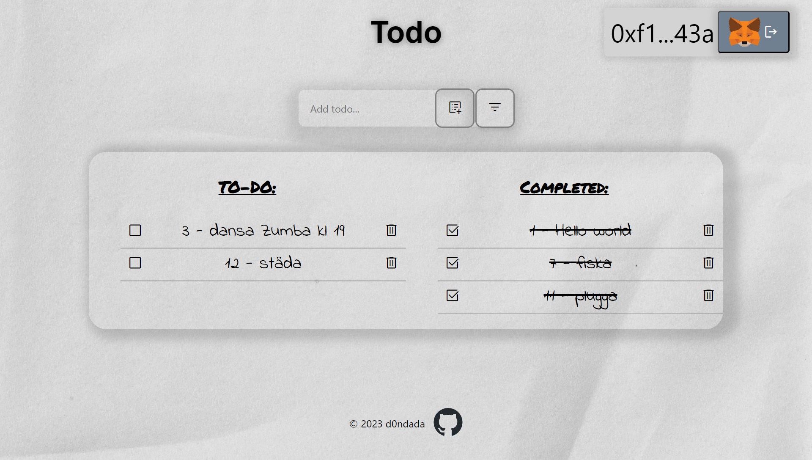

# Blockchain-based TODO List with Ganache
A decentralized application (DApp) that provides a simple TODO list, backed by Ethereum smart contracts. This DApp communicates with a smart contract deployed on a local blockchain managed by Ganache.



## 🛠 Prerequisites
Ganache - Personal blockchain for Ethereum development
Metamask - Crypto wallet & gateway to blockchain apps
Node.js - JavaScript runtime
## 🚀 Getting Started
1. Setup Ganache
Launch Ganache and initiate a local blockchain. Remember your RPC server details.

2. Deploy the Smart Contract
Navigate to the repo's root:

bash
```
truffle migrate --reset
```
This deploys the smart contract to the local Ganache blockchain.

1. Update ABI and Contract Address
Post-deployment, make sure to update TODO_LIST_ABI and TODO_LIST_ADDRESS with the new contract's ABI and address respectively.

1. Setup Metamask
Install and launch MetaMask.
Connect it to your local Ganache blockchain using Ganache's RPC URL.
Import a Ganache account into MetaMask with the account's private key.
1. Running the DApp
bash
```
cd todo
npm install
npm start
```
Open a browser, access the application, connect via MetaMask, and manage your TODOs!

## 🔄 Usage
Add TODOs: Use the input field.
Mark TODOs: Check as completed.
Remove TODOs: Delete as required.
# 🤝 Contributing
Contributions are welcome! Please see our contributing guidelines for more details.